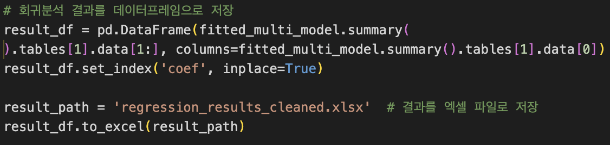
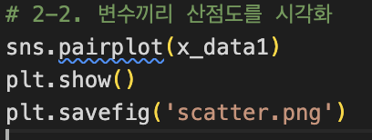
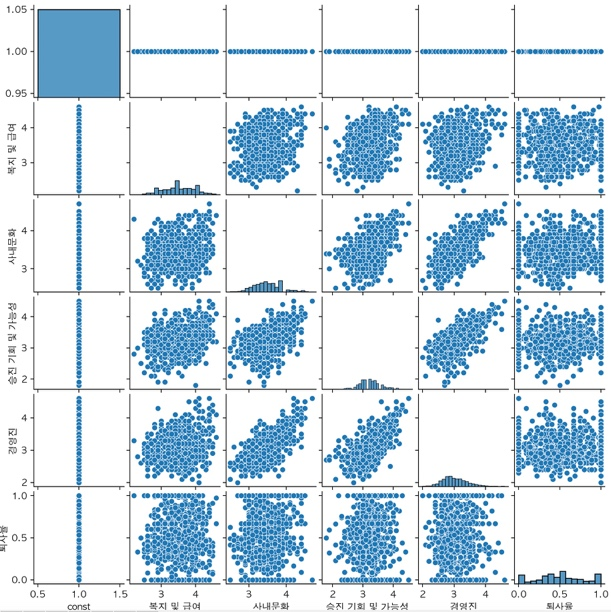

# 2021147510 김주은

## 주제: 워라밸을 결정하는 주된 요인은 무엇인가?

> 워라밸을 결정할 수 있는 요인들과 워라밸 사이의 상관관계 분석과 다중 회귀 분석을 중심으로

---

### 데이터: 잡플래닛을 직접 크롤링하여 얻은 데이터

(기존에는 노동 통계 통계 포털에 나와있는 산업_규모별 근로시간 데이터와 사업체 노동력 조사 데이터를 사용하려고 했으나, 워라밸과 관련된 평가 항목이 임금과 이직률 이외에는 없기도 하고, 두 개의 데이터의 행을 기준으로 join을 해서 사용하는 경우 데이터가 20개밖에 되지 않기 때문에 잡플래닛의 데이터를 직접 크롤링해서 사용하기로 하였음.)

---

### 데이터 형식: 총 883개의 기업(행)에 대하여 8개의 열의 데이터를 조사하였음.

5개의 점수의 경우 잡플래닛 이용자들이 직접 설문에 참여하여 기록한 별점의 평균값임.

- 복지및급여 점수
- 업무와 삶의 균형(워라밸) 점수
- 사내문화 점수
- 승진 기회 및 가능성 점수
- 경영진 점수
- 연봉
- 입사자
- 퇴사자

행 항목: 잡플래닛의 상위 인기 883 개 기업

---

## 1. 입력 데이터 처리(가공 및 생성)

크롤링 코드 : `crolling.py`  
사용 기술 : `Pandas`, `Selenium`, `BeautifulSoup`

**데이터를 직접 생성한 이유**:

고용노동 통계 포털의 기존 데이터는 행 일치가 어려워 일반성 결여. 워라밸을 설명하기에 불충분하여 직접 생성.또한 워라밸의 요소로 판단할 수 있는 데이터로 근무시간이 전부였기 때문에 워라밸의 임계를 찾고자 하는 주제에는 부족한 데이터로 느껴졌음.

### 데이터 생성 과정:
1) 잡플래닛 데이터의 경우에는 특정 정보를 가져오기 위하여 로그인이 필요하므로, 셀레니움을 통하여 로그인을 한 이후에 크롤링을 진행하였음.

2) 총 100페이지에 달하는 기업 순위 리스트에서 각 기업의 고유 company id와 company name을 가져와서 list에 dictionary 형태로 저장하였음.

3) 해당 dictionary에 저장된 company id를 이용하여 ‘/reviews/’  url에 접근하여 5개의 평가 점수를 획득하고

4) 연봉 입사자 퇴사자 정보는 다른 url 에 존재하기 때문에, ‘salaries’ url 에 접근하여 데이터를 가져왔음.

### 데이터 가공:

1) 데이터를 가져오는 과정에서 특정 정보가 없거나 exception error가 발생하는 경우 데이터를 가져오지 못하였으므로, 정보가 없는 데이터를 담은 행의 경우에는 아예 데이터 파일에서 삭제하였음. 또한, Exception Handling을 위해 아래의 코드를 추가하였음.

2) 퇴사자 수 대신 `퇴사율 = 퇴사자 수 / (입사자 수 + 퇴사자 수)` 추가

---

## 2. 문제 해결 방법 (알고리즘 개요)

### 1) 가설 또는 질문:

1. 복지, 사내문화, 승진기회, 경영진 점수는 워라밸 점수와 양의 상관관계를 가진다. 특히 복지 점수가 가장 클 것이다.  
2. 퇴사율은 워라밸과 음의 상관관계를 가진다.

### 2) 알고리즘:

- 다중 선형 회귀 분석 (OLS, `statsmodels`, `pandas`)
- 상관계수 히트맵 (`seaborn`, `pandas`, `Matplotlib`)
- 산점도 시각화 (`Matplotlib`)
- 다중공산성 확인 (`VIF`)
  
#### 1) 다중 선형 회귀 분석:
1. target_data 는 “업무와 삶의 균형(워라밸)”으로 설정하고 , 나머지 변인들은 x_data 데이터 프레임에 불러온다.

2. 선형 회귀분석을 위한 상수항을 계산하고, 상수항을 추가하여 x_data1에 담는다.
   
3. statsmodel 라이브러리를 사용하여 ols검정을 진행한다.

4.진행된 값을 바탕으로 summary데이터를 엑셀파일로 저장한다.

#### 2) 상관계수, 산점도 시각화:

1.seaborn 라이브러리를 사용하여 1)에서 ols검정을 통하여 계산된 x_data1을 이용하여 상관계수 시각화를 히트맵으로 진행한다.

2.마찬가지로 seaborn 라이브러리를 이용하여 변수들의 산점도를 시각화 한다.

#### 3) VIF를 이용한 다중공산성 체크

1,2에서 이용한 x_data1을 이용하여 VIF 벡터를 추출하고 다중공산성을 체크할 수 있다. 
VIF 값이 1에 가까울 수록 다중공산성의 문제가 낮다고 판단할 수 있다.

다중 공산성이 있는 경우에는 회귀 계수의 추정이 불안정하므로, 다중공산성 체크를 이용하여 강한 상관관계가 있는 feature은 제거하고 다시 회귀분석을 하는 것이 도움이 된다.

---

## 3. 프로그램의 전체적인 구조

### [1] 프로그램 구조:

**데이터 파일**:
- `Company1000.xlsx`: 기업명 + 고유 ID
- `jobPlanetData_Total.xlsx`: 크롤링 원본
- `data_after_preprocess1.xlsx`: 전처리 결과

**파이썬 파일**:
- `crolling.py`: 크롤링 코드
- `data_preprocessing.py`: 전처리 코드
- `algorithm.py`: 회귀분석 + 시각화

**결과물**:
- `regression_results_clean1.xlsx`: 회귀 결과
- 산점도 이미지:
  - `산점도1.png`, `산점도2.png`
- 상관관계 히트맵:
  - `상관관계_히트맵1.png`, `상관관계_히트맵2.png`
---

### [2] 프로그램 특징:

1. 700개 기업 데이터를 직접 8개 지표로 크롤링  
2. 회귀분석 + 히트맵 + 산점도로 변수간 관계 시각화  
3. VIF로 다중공산성 검토 → 불필요 변수 제거 후 재분석

### [3] 사용된 라이브러리

---

## 4. 데이터 분석 결과

### 1. 최초 분석 결과 target column="업무와 삶의 균형(워라밸)"

### [다중회귀분석 Summary 표]

| 항목               | coef   | std err | t      | P>|t| | [0.025 | 0.975] |
|--------------------|--------|---------|--------|-------|--------|--------|
| const              | **2.4783** | 0.162   | 15.294 | 0.000 | 2.160  | 2.796  |
| 복지 및 급여       | **0.2050** | 0.032   | 6.357  | 0.000 | 0.142  | 0.268  |
| 사내문화           | **0.5917** | 0.052   | 11.379 | 0.000 | 0.490  | 0.694  |
| 승진 기회 및 가능성 | -0.4129 | 0.047   | 8.796  | 0.000 | 0.505  | 0.321  |
| 경영진             | -0.0886 | 0.056   | 1.585  | 0.113 | 0.198  | 0.021  |
| 퇴사율             | 0.0682  | 0.049   | 1.381  | 0.168 | 0.029  | 0.165  |

- 가장 큰 상관관계 변수: **사내문화**
- 퇴사율은 예측과 다르게 **미약한 양의 상관관계**
- p-value 거의 0 → 모델 유효성 높음

---

### [VIF 분석 결과]:

- 경영진 변수는 다중공산성 높아 제거

- 제거 후 VIF Factor

---

### 2. 경영진에대한 별점 변수 제거 후 회귀분석 재실행

### [다중회귀분석 Summary 표 - 경영진 제거 후]

| 항목               | coef   | std err | t       | P>|t| | [0.025 | 0.975] |
|--------------------|--------|---------|---------|------|--------|--------|
| const              | 2.4931 | 0.162   | 15.397  | 0.000 | 2.175  | 2.811  |
| 복지 및 급여       | 0.2017 | 0.032   | 6.264   | 0.000 | 0.139  | 0.265  |
| 사내문화           | 0.5441 | 0.043   | 12.802  | 0.000 | 0.461  | 0.628  |
| 승진 기회 및 가능성 | -0.4479 | 0.041   | -10.803 | 0.000 | -0.529 | -0.367 |
| 퇴사율             | 0.0743 | 0.049   | 1.507   | 0.132 | -0.022 | 0.171  |

## 다중 공산성이 높은 경영진 변수 제거 전/후 

### [1] VIF 값 개선
<table>
  <tr>
    <th>제거 전</th>
    <th>제거 후</th>
  </tr>
  <tr>
    <td></td>
    <td></td>
  </tr>
</table>

- 계수 변화 크지 않음
- VIF 확실히 개선됨

---

## 비교 분석

### [1] VIF 값 개선

---

### [2] 상관계수 히트맵 변화

---

### [3] 산점도 비교

- 제거 전: 변수 간 상관관계 강함  
- 제거 후: 둥근 분포 → 다중공산성 감소

---

## 결론

1. 퇴사율 제외 대부분은 워라밸과 양의 상관관계  
2. **가장 큰 영향 요인 = 사내문화**  
   - 복지 예상이 빗나감  
   - 직장 분위기의 중요성 재확인 (잡코리아 설문과 일치)

> 📎 참고: [잡코리아 기사](https://www.jobkorea.co.kr/goodjob/tip/view?News_No=21586)

3. 퇴사율은 실제로 워라밸과 **크게 관련 없음**

