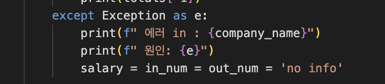

# 2021147510 김주은

## 주제: 워라밸을 결정하는 주된 요인은 무엇인가?

> 워라밸을 결정할 수 있는 요인들과 워라밸 사이의 상관관계 분석과 다중 회귀 분석을 중심으로

---

### 데이터: 잡플래닛을 직접 크롤링하여 얻은 데이터

(기존에는 노동 통계 통계 포털에 나와있는 산업_규모별 근로시간 데이터와 사업체 노동력 조사 데이터를 사용하려고 했으나, 워라밸과 관련된 평가 항목이 임금과 이직률 이외에는 없기도 하고, 두 개의 데이터의 행을 기준으로 join을 해서 사용하는 경우 데이터가 20개밖에 되지 않기 때문에 잡플래닛의 데이터를 직접 크롤링해서 사용하기로 하였음.)


---

### 데이터 형식: 총 883개의 기업(행)에 대하여 8개의 열의 데이터를 조사하였음.


5개의 점수의 경우 잡플래닛 이용자들이 직접 설문에 참여하여 기록한 별점의 평균값임.

- 복지및급여 점수
- 업무와 삶의 균형(워라밸) 점수
- 사내문화 점수
- 승진 기회 및 가능성 점수
- 경영진 점수
- 연봉
- 입사자
- 퇴사자

행 항목: 잡플래닛의 상위 인기 883 개 기업

---

## 1. 입력 데이터 처리(가공 및 생성)

크롤링 코드 : `crolling.py`  
사용 기술 : `Pandas`, `Selenium`, `BeautifulSoup`

**데이터를 직접 생성한 이유**:

고용노동 통계 포털의 기존 데이터는 행 일치가 어려워 일반성 결여. 워라밸을 설명하기에 불충분하여 직접 생성.또한 워라밸의 요소로 판단할 수 있는 데이터로 근무시간이 전부였기 때문에 워라밸의 임계를 찾고자 하는 주제에는 부족한 데이터로 느껴졌음.


### 데이터 생성 과정:
1) 잡플래닛 데이터의 경우에는 특정 정보를 가져오기 위하여 로그인이 필요하므로, 셀레니움을 통하여 로그인을 한 이후에 크롤링을 진행하였음.


2) 총 100페이지에 달하는 기업 순위 리스트에서 각 기업의 고유 company id와 company name을 가져와서 list에 dictionary 형태로 저장하였음.
 


### 데이터 가공:

- 정보가 없는 행 삭제
- 퇴사자 수 대신 `퇴사율 = 퇴사자 수 / (입사자 수 + 퇴사자 수)` 추가


---

## 2. 문제 해결 방법 (알고리즘 개요)

### 1) 가설 또는 질문:

1. 복지, 사내문화, 승진기회, 경영진 점수는 워라밸 점수와 양의 상관관계를 가진다. 특히 복지 점수가 가장 클 것이다.  
2. 퇴사율은 워라밸과 음의 상관관계를 가진다.

### 2) 알고리즘:

- 다중 선형 회귀 분석 (OLS, `statsmodels`)
- 상관계수 히트맵 (`seaborn`)
- 산점도 시각화
- 다중공산성 확인 (VIF)


---

## 3. 프로그램의 전체적인 구조

### [1] 프로그램 구조:

**데이터 파일**:
- `Company1000.xlsx`: 기업명 + 고유 ID
- `jobPlanetData700.xlsx`: 크롤링 원본
- `after_preprocess.xlsx`: 전처리 결과

**파이썬 파일**:
- `crolling.py`: 크롤링 코드
- `data_preprocessing.py`: 전처리 코드
- `algorithm.py`: 회귀분석 + 시각화

**결과물**:
- `regression_results_clean1.xlsx`: 회귀 결과
- 산점도 이미지:
  - `산점도1.png`, `산점도2.png`
- 상관관계 히트맵:
  - `상관관계_히트맵1.png`, `상관관계_히트맵2.png`




---

### [2] 프로그램 특징:

1. 700개 기업 데이터를 직접 8개 지표로 크롤링  
2. 회귀분석 + 히트맵 + 산점도로 변수간 관계 시각화  
3. VIF로 다중공산성 검토 → 불필요 변수 제거 후 재분석

---

## 4. 데이터 분석 결과

### 1. 최초 분석 결과 (경영진 포함)

```text
const       2.4783
복지 및 급여  0.2050
사내문화     0.5917
승진 기회    -0.4129
경영진       -0.0886
퇴사율        0.0682
```


- 가장 큰 상관관계 변수: **사내문화**
- 퇴사율은 예측과 다르게 **미약한 양의 상관관계**
- p-value 거의 0 → 모델 유효성 높음

---

### [VIF 분석 결과]:

- 경영진 변수는 다중공산성 높아 제거


---

### 2. 경영진 제거 후 회귀분석 재실행

```text
const       2.4931
복지 및 급여  0.2017
사내문화     0.5441
승진 기회    -0.4479
퇴사율        0.0743
```


- 계수 변화 크지 않음
- VIF 확실히 개선됨

---

## 비교 분석

### [1] VIF 값 개선


---

### [2] 상관계수 히트맵 변화


---

### [3] 산점도 비교

- 제거 전: 변수 간 상관관계 강함  
- 제거 후: 둥근 분포 → 다중공산성 감소


---

## 결론

1. 퇴사율 제외 대부분은 워라밸과 양의 상관관계  
2. **가장 큰 영향 요인 = 사내문화**  
   - 복지 예상이 빗나감  
   - 직장 분위기의 중요성 재확인 (잡코리아 설문과 일치)

> 📎 참고: [잡코리아 기사](https://www.jobkorea.co.kr/goodjob/tip/view?News_No=21586)

3. 퇴사율은 실제로 워라밸과 **크게 관련 없음**


